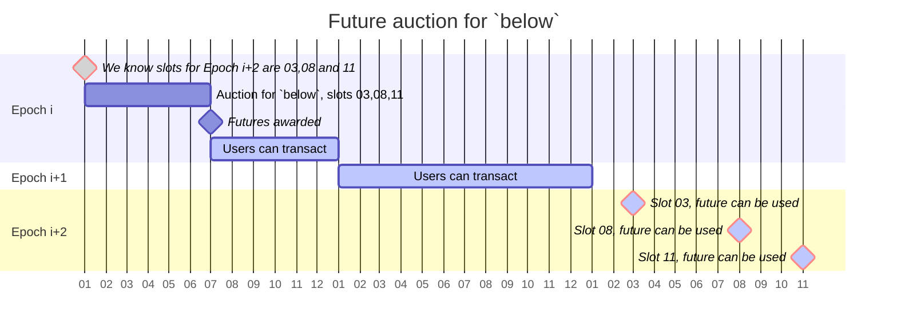

## **MEV Searchers**

MEV searchers can also use SecureRPC for bundle / transaction submission. The endpoint above
supports the following MEV methods:

- `eth_sendRawTransaction`
- `manifold_sendBundle`
- `eth_sendBundle`
- `manifold_sendPrivateRawTransaction`

## Block Structure

we divide a block in two parts:

One part, called

- also referred to as `above` - represents the top part of the blockspace. Economically, this is
  where competitive searchers want to place their transactions (e.g. for arbitrages etc.) The other
  part, called
- also referred to as `below` - represents the rest of the blockspace. Economically, this is where
  low-priority transactions - direct transfers, low volume swaps, some kind of intents, etc. - would
  go. The rationale for this is simple: `above` and below represent two very different markets: The
  first serves strategic actors, whereas the second serves 'everyone else' - people not interested
  in speculation that just want to transact, e.g., to pay for stuff.

`above` is a very time sensitive kind of blockspace, as mev-rich txs often come in last minute.

On the other hand, below is not very time sensitive, and designing a futures market for it is
easier.

:::info[title="Enforcing Transaction Inclusion"]

The idea is this: Since we run our own validators, we will know 2 epochs in advance in which slots
we will mint a block. So, we can sell that blockspace about 2 epochs in advance, providing a futures
market for below. The following diagram shows an example of how this would work. Crucially, we want
users to be able to transact, that is, to be able to resell the futures on a secondary market.

:::

## Current MEV Boost Auction

:::note

A representation of transaction and block propagation with Proposer Builder Separation.

:::

(1) Searchers receive transactions from the P2P layer and generate transaction bundles using their
specific MEV extraction knowledge. (2) These bundles are then sent to one or more builders. (3)
Builders, who also receive transactions from the P2P layer, bundle blocks considering the
transactions and bundles from searchers, guided by their local profit maximization algorithm. (4)
Builders connect with relays and send new maximum profit blocks to these relays as they’re
discovered. (5) Upon request, relays share the status of the maximum profit bid with the next block
proposer. (6) The block proposer, who receives transactions from the P2P layer as well, decides
which block to mine based on the relay information and their own interests. (7) If the block
proposer chooses the block from the relay, they return the signed block header, prompting the relay
to share the actual block

