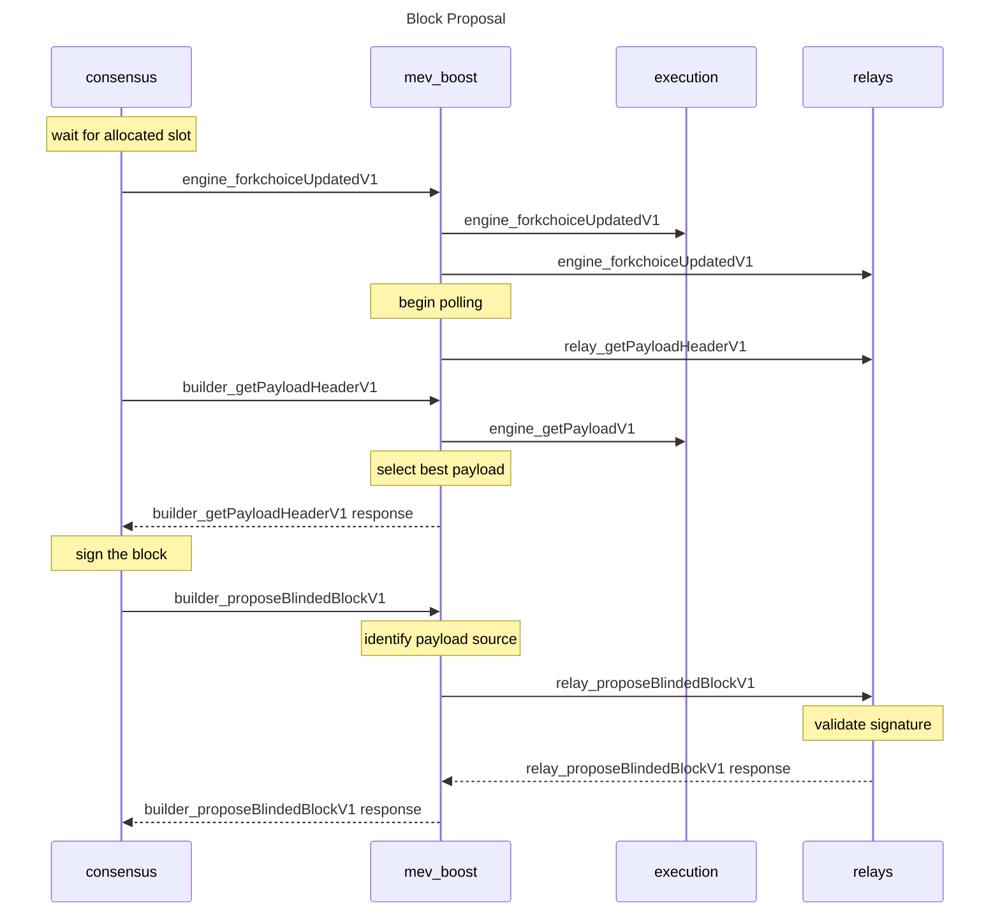

## Auction Platform

Note that clearing and settlement is separate from the auction platform.

## Venues

### Gas Venues

- Primary Market
- Secondary Market
- Inclusion Market

## MEV Boost

```mermaid
sequenceDiagram
    participant consensus
    participant mev_boost
    participant execution
    participant relays
    Title: Block Proposal
    Note over consensus: wait for allocated slot
    consensus->>mev_boost: engine_forkchoiceUpdatedV1
    mev_boost->>execution: engine_forkchoiceUpdatedV1
    mev_boost->>relays: engine_forkchoiceUpdatedV1
    Note over mev_boost: begin polling
    mev_boost->>relays: relay_getPayloadHeaderV1
    consensus->>mev_boost: builder_getPayloadHeaderV1
    mev_boost->>execution: engine_getPayloadV1
    Note over mev_boost: select best payload
    mev_boost-->>consensus: builder_getPayloadHeaderV1 response
    Note over consensus: sign the block
    consensus->>mev_boost: builder_proposeBlindedBlockV1
    Note over mev_boost: identify payload source
    mev_boost->>relays: relay_proposeBlindedBlockV1
    Note over relays: validate signature
    relays-->>mev_boost: relay_proposeBlindedBlockV1 response
    mev_boost-->>consensus: builder_proposeBlindedBlockV1 response
```